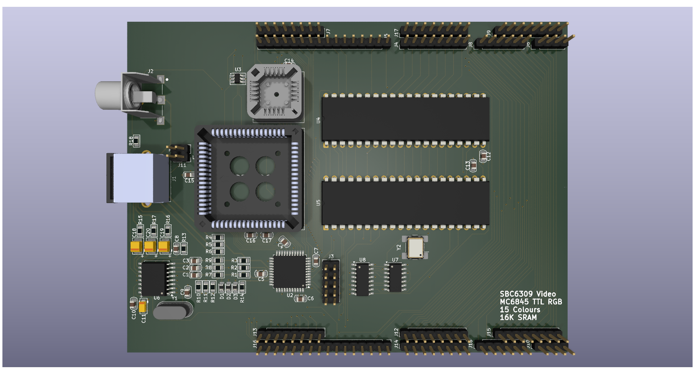

# SBC6309 Video Inspired by Acorn System 2 #

This started out as a reimplementation of the Acorn system 2 teletext card.
That design quickly went in the bin in favour or something closer to the
video implementation of the BBC Model A/B or Amstrad CPC464.

## Theory of Operation ##

The design is based around a MC6845 CRTC for video timing and sync generation.
This is supplemented with a MC6821 to provide additional control over 
variables outside of the CRTC capability (such as colour palette control)

The conversion of byte data into graphic output is handled by a small CPLD
generating TTL RGB (with a half-bright to facilitate 15 colours).

Optionally the RGB is converted to Chroma and Luma for S-video and Composite
(all in PAL format). Note the RGB doesn't have to be PAL timing but the 
composite will not operate correctly if the timing is abused. Conversion is
performed by a AD724JRZ encoder.

### Clocks ###

The pixel clock is generated on the board starting with a 32MHz oscillator,
this is divided down to 16, 8, 4 or 2MHz. At the same time the data clock is
fixed and synchronised at quarter of the pixel clock.

The choice of divider is controlled by the PIA. Changing the divider requires
the CRTC register values to be reset.

### Video Memory ###

To simplify the design the board uses 16K of dual-port SRAM, this decouples
the main clock of the computer from the video clock, allowing it to run out
of phase without repurcussions. While dual-port ram is expensive, the chip
used here can be obtained at a price comparable to regular SRAM (still more
expensive but not prohibitively so).

From the perspective of the host the video memory is just an 8K window, the
address range is paged via the PIA to expand to the full 16K.

### System Integration ###

The board uses a 16V8 GAL to integrate the board into the rest of the computer
for the purposes of mapping main bus addresses to the video ram and to the CRTC
and PIA.

The main video (RGB) output is through a 9-pin mini-din socket, this incorporates
stereo audio output not generated on this board. The signal can be injected via a
pair of two pin headers.

## Plans ##

### Text Mode ###

The objective is to create a single general purpose video board for the SBC6309
project which must include a text-only mode. To achieve this the board needs to
incorporate a character generator ROM. A set of 256 characters at 8 bytes per
character requires a 2K address space, the CRTC provides row addressing for up
to 32 bytes. Assuming the maximum the requirement increases to 8K but a 8 pixel
x 32 pixel character is of limited use. A more practical solution is to utilise
the 16 byte option and map the rows to 8, 10 or 12. An 8K rom would allow for two
different character sets, possibly at different row counts.

Switching between bitmap and character modes can be performed using a simple
74LS157 multiplexer (two required) depending on the mode. Graphic data can be mapped
to both the multiplexer directly (bitmap) or via the character rom (text).

### Larger Address Space ###

The 6845 can address a maximum of 512KB - way beyond the addressing capability
of the host. With an 8K window that 64 pages. Expanding to a 16K window would make 
this more digestable. The cost of dual-port ram would become excessive however to
take this to the maximum.

Increasing to 32K (or 64K) falls within reasonable design and cost limits.

The mechanism for expanding the address space is the same as used for text mode,
leveraging the row address registers. By adjusting the design for one, the other
becomes inherent.

Referring back to the BBC Model A/B and Amstrad CPC the same trick is used. In
the BBC the row address is effectively the lower 3 bits of the address so that
the bitmap proceeds vertically for 8 bytes before moving to the next horizontal
position. The Amstrad moves the row address on so that each row of video data
is consecutive but vertically jumps 8 rows before returning to the top (offset
by a row) and proceeding again